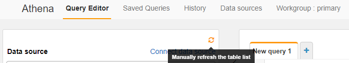
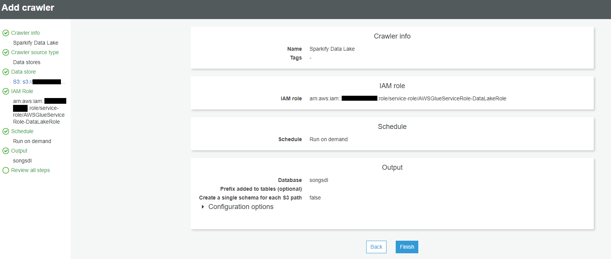
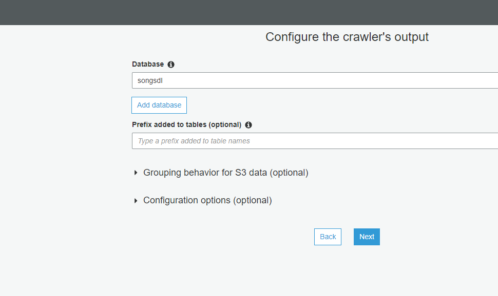
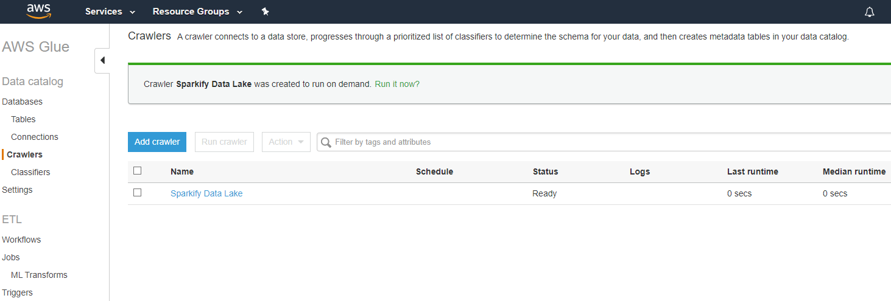
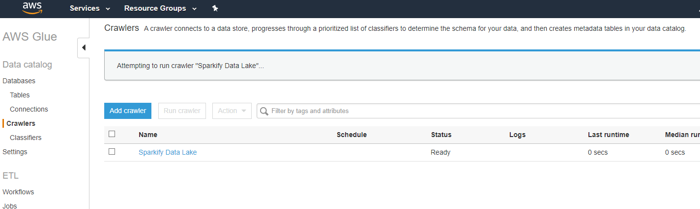
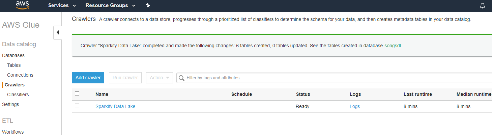
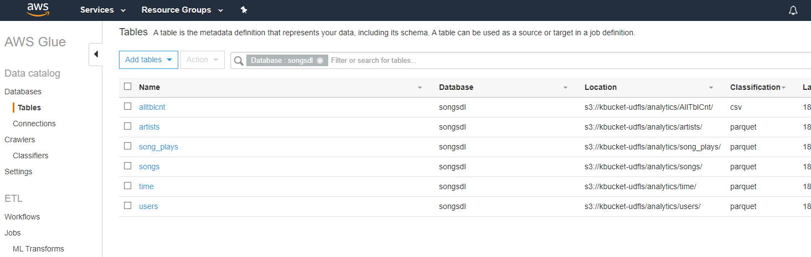

# Cloud Data Lake on AWS
#### using S3, EMR, Spark, Boto3, Python, Hadoop, Hive, Parquet, ETL, Athena, Glue
---

### Contents
        - Business Requirement
        - Solution for Data Lake in AWS cloud
        - Datasets
        - Data Wrangling and Cleaning
        - Output Table Design
        - File Contents and purpose of each file
        - How to Run
        - Sample Execution

---
### Business Requirement:
- A music streaming company, Sparkify has grown their user base and song database more.
- Now, they **want to move their data warehouse to a data lake.** 
- Their data resides in **S3**,
- in a directory of **JSON logs on user activity** on the app, 
- as well as a directory with **JSON metadata** on the songs in their app.  


## Solution for Data Lake in AWS cloud:


- Data engineering done. User utilizes **Python script** ```launch_cluster.py``` that creates **Data Lake** cluster   
  in **EMR** on **AWS** cloud. This provisions EC2 m5.xlarge instances _on-demand_ (1 Master, 2 Core nodes).  
- **Spark scripts** are copied from S3 over to **EMR** as part of step execution on new cluster job.  
- **Spark DataFrames** loaded after reading **JSON** _input_data_ from **S3** bucket.  
- Dataframe **transformations** done using **PySpark** functions, custom **UDF** and **Spark.sql** queries  
  utilizing temporary **table views** for  _dimensional tables_ and _fact table_ in **Hadoop Hive**  
- All tables created are then stored in **parquet** format to _output_data_ bucket back to **S3** along   
  with table counts as CSV files for verfication.  
- As part of Spark job, _run_analytics_ function runs queries given by **analytics team**. This   
  does analysis and continue finding _insights_ for team about what songs users are listening to.  
- Data Lake EMR **cluster terminated automatically** upon job completion.  
- Additionally, cross check done using **Glue** crawler (to create data store) and **Athena** queries to  
  verify table counts directly from S3 and compare against previous CSV files present in _output_data_  


### Datasets:
---

Working with two datasets that reside in S3. Here are the S3 links for each: 

1. Song data: `s3://udacity-dend/song_data`
2. Log data: `s3://udacity-dend/log_data`

**Song Dataset**

The first dataset is a subset of real data from the [Million Song Dataset](https://labrosa.ee.columbia.edu/millionsong/). Each file is in JSON format and contains metadata about a song and the artist of that song. The files are partitioned by the first three letters of each song's track ID. For example, here are filepaths to two files in this dataset. 

```
song_data/A/B/C/TRABCEI128F424C983.json 
song_data/A/A/B/TRAABJL12903CDCF1A.json
```

And below is an example of what a single song file, TRAABJL12903CDCF1A.json, looks like:
```json
{"num_songs": 1, "artist_id": "ARJIE2Y1187B994AB7", "artist_latitude": null, "artist_longitude": null, "artist_location": "", "artist_name": "Line Renaud", "song_id": "SOUPIRU12A6D4FA1E1", "title": "Der Kleine Dompfaff", "duration": 152.92036, "year": 0}
Log
```


**Log Dataset**

The second dataset consists of log files in JSON format generated by this [event simulator](https://github.com/Interana/eventsim) with activity logs from a music streaming app based on specified configurations. The log files in the dataset are partitioned by year and month.

For example, here are filepaths to two files in this dataset. 
```
log_data/2018/11/2018-11-12-events.json
log_data/2018/11/2018-11-13-events.json
```


And below is an example of what the data in a log file, 2018-11-12-events.json, looks like.

```
{"artist":"Blue October \/ Imogen Heap","auth":"Logged In","firstName":"Kaylee","gender":"F","itemInSession":7,"lastName":"Summers","length":241.3971,"level":"free","location":"Phoenix-Mesa-Scottsdale, AZ","method":"PUT","page":"NextSong","registration":1540344794796.0,"sessionId":139,"song":"Congratulations","status":200,"ts":1541107493796,"userAgent":"\"Mozilla\/5.0 (Windows NT 6.1; WOW64) AppleWebKit\/537.36 (KHTML, like Gecko) Chrome\/35.0.1916.153 Safari\/537.36\"","userId":"8"}
```


### Data Lake Design:
---
Data Lake resides within S3 and makes use of on-demand EMR instance to process etl and run analytics. The EMR terminates cluster upon completion of etl and analytical processing and generates outputs that are written back to S3. 

For **Storage - S3** was chosen for this Data Lake storage of both input data of unstructured/semi structured json files, output data in parquet format of all Tables for ease retrieval. "S3 offers an extremely durable, highly available, and infinitely scalable data storage infrastructure at very low costs. Amazon S3 provides a simple web service interface that you can use to store and retrieve any amount of data, at any time, from anywhere on the web."[*](https://aws.amazon.com/s3/faqs/)

For **Processing - EMR** cluster of 3 **EC2** instances _on-demand_ nodes  of _m5.xlarge_ were used. EMR offered ease to use, low cost , elastic, reliable, secure, flexible options to this case of performing cost-effective data tranformation workload for the analytics team. EMR with Spark allowed the entire analysis job finishes in less than 15 mins, consuming all the data and providing S3 parquet files of table data and counts in csv files. Boto3 allowed lanuch configurations ease creation with automatic job execution of steps and cluster termination upon completion.

The following **Schema** were identified _after analysing data_ used from the sample **_log\_data_** and **_song\_data_** JSON files. Based on these, **Spark Dataframes** were _loaded_ into and _tranformed_ using **PySpark** functions and **Spark.sql**. Several of these are kept as StringType and then later transformed within PySpark, making use of **UDF** for unix epoch date to timestamp format conversion.


### Staging Tables design (Spark DataFrames)
---
**Spark DataFrame dfSongsData Schema (used to load combined JSON files for song_data from S3):**
```python
num_songs IntegerType(),
artist_id StringType(),
artist_latitude FloatType(),
artist_longitude FloatType(),
artist_location StringType(),
artist_name StringType(),
song_id StringType(),
title StringType(),
duration StringType(),
year StringType()
```

From dfSongsData, **duplicates removed** and temp **Hadoop Hive table** view **songs** created to be used for dimension table SONGS:
` song_id, title, artist_id, year, duration`

From dfSongsData, **duplicates removed**, few columns renamed and temp **Hadoop Hive table** view **artists** created to be used for dimension table ARTISTS:
`artist_id, name, location, latitude, longitude`


**Spark DataFrame dfLogData (used to load combined JSON files for log_data from S3):**
```python
artist StringType(),
auth StringType(),
firstName StringType(),
gender StringType(),
itemInSession IntegerType(),
lastName StringType(),
length FloatType(),
level StringType(),
location StringType(),
method StringType(),
page StringType(),
registration FloatType(),
sessionId IntegerType(),
song StringType(),
status IntegerType(),
ts StringType(),
userAgent StringType(),
userId String Type()
```
From dfLogData, **duplicates removed** and temp **Hadoop Hive table** view **users** created to be used for dimension table USERS:
`user_id, first_name, last_name, gender, level`

From dfLogData, **duplicates removed**. An **UDF** was used to convert epoch values for column 'ts' from logData to below units of hour, day, week, month, year, weekday. Column was also renamed to start_time. Temp **Hadoop Hive table** view is created to be used for dimension table TIME:
`start_time, hour, day, week, month, year, weekday`

From all the previous created table views of _songs, users, artists, time_, fact table is created. An unique key identifier column songplay_id is added to to the fact table SONGPLAYS:
`songplay_id, start_time, user_id, level, song_id, artist_id, session_id, location, user_agent`

After processing, above tables are **written** to file as **parquet** format in **S3**.
Additonally, of the above table's views are used to do table query row counts and also written to S3.
The _on-demand_ EMR cluster is then **terminated**, leaving a **serverless** Data Lake, with all tables residing back in S3.


### Analytical Table Design 
##### (stored in S3 as Parquet files under output_data/analytics folder)
---

#### Dimension Tables:

SONGS:
_partitioned by (year, artist_id)_
```python
song_id StringType(),
title StringType(),
artist_id StringType(),
year StringType(),
duration StringType()
```


ARTISTS:
```python
artist_id StringType(),
name StringType(),
location StringType(),
latitude FloatType(),
longitude FloatType()
```

USERS:
```python
user_id StringType(),
first_name StringType(),
last_name StringType(),
gender StringType(),
level StringType()
```


TIME:
_partitioned by (yearType(), month)_
```python
start_time TimestampType(),
hour TimestampType(),
day TimestampType(),
week TimestampType(),
month TimestampType(),
year TimestampType(),
weekday TimestampType()
```

#### Fact Table:

SONGSPLAYS
```python
songplay_id (unique identifer with incremental value),
start_time TimestampType(),
user_id StringType(),
level StringType(),
song_id IntegerType(),
artist_id StringType(),
session_id IntegerType(), 
location StringType(),
user_agent StringType()
```

### Validation on (S3, Athena, Glue Serverless Services)
---
Serverless services Glue and Athena, verification of S3 table files and table count queries run as a additional level validation of files written in tables.


### File Contents and purpose of each file:
---

#### Local Files
- **README.md** - README file that includes summary, how to run and an explanation of all the files
- **images** - folder containing all images for README.md
- **env.sh** - Bash script to update environment PATH and make all .py files executeable
- **lanuch_cluster.py** - Python script to lanuch create EMR cluster, inclues specifications for EC2 instances, job execution
- **cluster_add_step.py** - Python script to add additional step to EMR cluster job
- **cluster_status.py** - Python script to check active EMR cluster status
- **cluster_terminate.py** - Python script to terminate EMR cluster
- **config.py** - Python file with configuration params

#### Files to be uploaded to S3 bucket \$SPARK_SCRIPTS
- **etl.py** - Spark script that reads all input_data files from S3, does Dataframe transformations using PySpark functions, custom UDF and Spark.sql queries. Makes temporary table views for dimensional tables and fact_table in Hadoop Hive. Then, writes these table out to output_data files in S3 along with table counts. Finally, runs analytics queries and save their output to S3.
- **config.py** - Python file with configuration params

**Note: config.py**  needs to be updated with the parameters for scripts to work. Upload a copy of it, along with **etl.py** to S3 bucket **\$SPARK_SCRIPTS**


### Config Parameters:
---
For the scripts to work, the following need to be updated in config.py:

- AWS_ACCESS_KEY_ID: AWS account KEY ID to be used with scripts
- AWS_SECRET_ACCESS_KEY: AWS account SECRET KEY to be used with scripts
- REGION_NAME: AWS account REGION to be used with scripts (ideally US-WEST-2)
- ACCOUNT_NUM: AWS account number
- CLUSTER_NAME: AWS account number
- EC2KEYNAME: EC2 Key Pair to be used with EMR EC2 instances
- MASTERINSTANCETYPE: EMR Master node EC2 instance type e.g. m5.xlarge
- SLAVEINSTANCETYPE: EMR Slave node EC2 instance type e.g. m5.xlarge
- INSTANCECOUNT: EMR nodes counts (e.g. 1 Master, 2 nodes = 3)
- EC2SUBNETID: EMR EC2 nodes Subnet id
- EMRMANAGEDMASTERSECURITYGROUP: EMR Master node Security Group id
- EMRMANAGEDSLAVESECURITYGROUP: EMR Master node Security Group id
- INPUT_BUCKET: S3 bucket to read song_data and log_data folders
- OUTPUT_BUCKET: S3 bucket to place output data for analytical tables (for songs, users, time, artirsts, songplays) and csv files for table count and analytical queries resultset 
- SPARK_SCRIPTS: S3 bucket to place Spark script files etl.py and config.py

### How to run:
---
#### 1. Setup AWS account:
- Open an AWS account and create an ACCESS KEY ID and a SECRET KEY to be used for EMR execution.
- Update these in **config.py** for AWS_ACCESS_KEY_ID and AWS_SECRET_ACCESS_KEY
- For more info, check AWS docs: [Create and Activate AWS Account](https://aws.amazon.com/premiumsupport/knowledge-center/create-and-activate-aws-account/)  

#### 2. Setup three S3 buckets:
**Note:** All should buckets in _US-WEST-2_ region (close to S3 input bucket, to _reduce network traffic in reads_)   
- Create **1st** bucket for output_data: e.g. to be used in **s3://<bucket-name>/analytics/** this be used to store all tables created and their table counts.  
- Create **2nd** bucket to host Spark files in S3. We'll call this **SPARK_SCRIPTS** which will be used by EMR cluster later e.g. s3://songdl-sparkfls
- Create **3rd** bucket for Athena and Glue to store query results and data store files e.g. **s3://songdl-queries** 
- Upload **etl.py** and **config.py** to S3 **SPARK_SCRIPTS** bucket location.  
- Update this info in **config.py** OUTPUT_BUCKET and SPARK_SCRIPTS. For INPUT_BUCKET use the one that hosts song_data and log_data. Sample names provided in config.py  
For more info, check AWS docs: [Create a bucket](https://docs.aws.amazon.com/AmazonS3/latest/user-guide/create-bucket.html)


#### 3. Lanuch an EMR Cluster
- Open a terminal with public internet access and python installed. 
- Give execute permission on **env.sh**, then run it.
- PATH variable will be updated and all .py files made executables in folder.
- Execute **lanuch.py** which will initiate your EMR cluster creation and setup steps for SPARK_SCRIPTS files (etl.py and config.py) to be copied from S3 to run on cluster.
- For more info, check AWS docs: [Lanuching a cluster](https://aws.amazon.com/emr/faqs/#Launching_a_cluster) and    [EMR-GS-Launch-Sample-Cluster](https://docs.aws.amazon.com/emr/latest/ManagementGuide/emr-gs-launch-sample-cluster.html)

#### 4. Verify job execution and cluster termination:
- Run **cluster_status.py** to check current cluster state and  **cluster_add_step.py** to add any additional cluster job steps (edit the file and place in variable _ListofSteps_, then run).
- Alternatively, use EMR console on AWS to verify Spark job execution and App history with STDERR and STDOUT.
- Check Spark step execution and progress.
- Verify job has completed and cluster has been terminated.
- For more info, check AWS docs: [EMR Manage View Clusters](https://docs.aws.amazon.com/emr/latest/ManagementGuide/emr-manage-view-clusters.html">https://docs.aws.amazon.com/emr/latest/ManagementGuide/emr-manage-view-clusters.html), [Application History]("https://docs.aws.amazon.com/emr/latest/ManagementGuide/emr-cluster-application-history.html">https://docs.aws.amazon.com/emr/latest/ManagementGuide/emr-cluster-application-history.html), and [App History Spark UI](https://docs.aws.amazon.com/emr/latest/ManagementGuide/app-history-spark-UI.html">https://docs.aws.amazon.com/emr/latest/ManagementGuide/app-history-spark-UI.html)

#### 5. Run cluster_terminate.py to terminate job (only if needed)
- Run cluster_terminate.py
- Enter job id provided from status to terminate EMR cluster

#### 6. Verify all analytical tables created in S3 
##### (tables created under output_data/analytics folder, table counts folder with CSV, analytical queries results CSV )
- Verify Table folders created in output_data bucket e.g. OUTPUT_DATA/analytics/table_name  
- Verify CSV file for S3 table counts created under OUTPUT_DATA/analytics/AllTblCnt/
- Verify Analytical queries result CSV files under subfolders e.g. TOP_SONGS, TOP_ARTISTS, PAID_FREE_RT


#### 7. Initiate Glue Crawler from Athena
- Open Athena, select query editor, select 'from AWS Glue Crawler'


#### 8. Setup Glue Crawler (with S3 and Data store database)
- In AWS Glue, create a crawler and data store from S3 table files created.
    - Provide inputs for Crowler:
        - NAME
        - DATA STORE - s3://INPUT_DATA/
        - IAM ROLE  - create a new or use existing
        - SCHEDULE - select 'Run on-demand'
        - OUTPUT - Name of Database eg. songsdl. Create new if needed.
- Run the newly created crawler
- Select database > tables, tables will be popuplated in databse.
- For more info, check AWS docs: [Getting Started with AWS Glue Data Catalog](https://www.youtube.com/watch?v=qNojanBn1NY)  

#### 9. Verify Table count from Athena query
- With Crawler above setup, go back to Athena
- Select Refresh under Databse
-
- Now database is available, setup table count queries and run:

- The results should match up with the row counts in CSV file in AllTblCnt folder
- For more info, check AWS docs: [Athena Getting Started](https://docs.aws.amazon.com/athena/latest/ug/getting-started.html) and [Athena User Guide](https://aws.amazon.com/athena/getting-started/)


### Sample Run:
---

##### 1. Gave permission to execute and ran **env.sh**
```python
root@f8b518cd3ee7:/home/workspace# chmod 755 env.sh
root@f8b518cd3ee7:/home/workspace# ./env.sh
PATH updated
/opt/conda/bin:/opt/spark-2.4.3-bin-hadoop2.7/bin:/opt/conda/bin:/usr/local/sbin:/usr/local/bin:/usr/sbin:/usr/bin:/sbin:/bin:/home/workspace
*.py files made executeable
root@f8b518cd3ee7:/home/workspace# 
```

##### 2. Ran **lanuch_cluster.py**  
```python
root@f8b518cd3ee7:/home/workspace# ./lanuch_cluster.py 
CREATING CLUSTER:
EMR cluster start initiated.
```
##### 3. Checked status of cluster:  
```
root@f8b518cd3ee7:/home/workspace# ./cluster_status.py 
ACTIVE CLUSTERS in US-WEST-2:
CLUSTER_ID: j-2G7ML2GT64C5H  NAME: 'DataLake_DEV'  STATE: STARTING
```
After sometime:
```
root@f8b518cd3ee7:/home/workspace# ./cluster_status.py 
ACTIVE CLUSTERS in US-WEST-2:
CLUSTER_ID: j-2G7ML2GT64C5H  NAME: 'DataLake_DEV'  STATE: RUNNING
```
Status on EMR console (after job completion):  


Status on EMR console STDOUT of step for etl.py:  
  


##### 4. Terminated cluster (to be used only if need)  
```
root@f8b518cd3ee7:/home/workspace# ./cluster_terminate.py 
Enter Cluster id j-: j-2G7ML2GT64C5H
Termination initiated for Cluster j-2G7ML2GT64C5H
```

##### 5. Verify Tables created in S3:  
  
  


##### 6. Verify Tables counts in CSV file:  


#### 7. Initiate Glue Crawler from Athena


##### 8. Setup Glue Crawler
Opened Glue and setup a crawler with all parameters and ran:





Goto Database (songsdl) > Tables, able see tables now:


##### 9. Verify Table count from Athena query:

Ran table count queries:

Query results match up with CSV file in AllTblCnt folder

